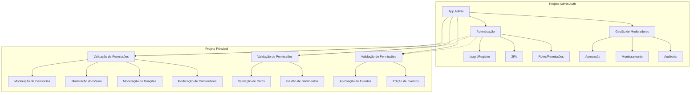
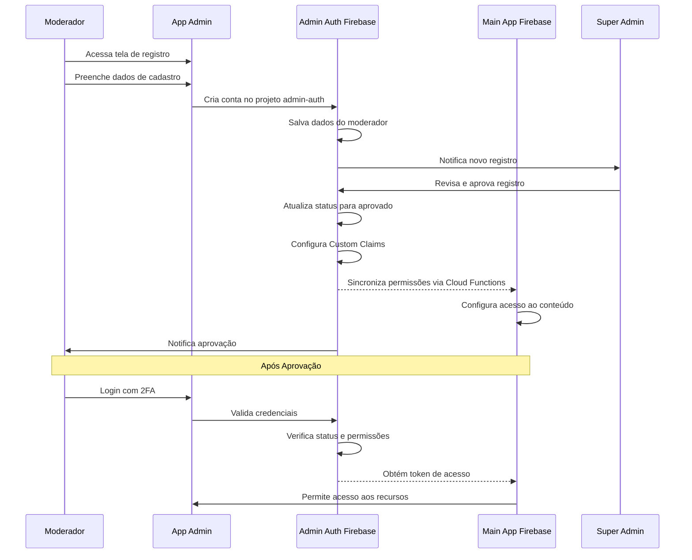
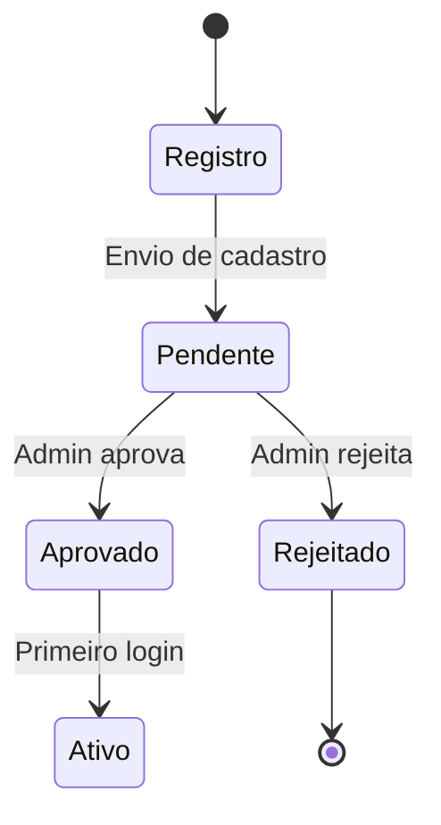

# Arquitetura do Aplicativo Administrativo - Rede Social de Ajuda Social

## Índice
1. [Visão Geral](#visão-geral)
2. [Estrutura do Sistema](#estrutura-do-sistema)
3. [Autenticação e Controle de Acesso](#autenticação-e-controle-de-acesso)
4. [Modelo de Dados](#modelo-de-dados)
5. [Funcionalidades](#funcionalidades)
6. [Fluxos do Sistema](#fluxos-do-sistema)
7. [Interface do Usuário](#interface-do-usuário)
8. [Integrações](#integrações)
9. [Considerações Técnicas](#considerações-técnicas)

## Visão Geral

O aplicativo administrativo é uma solução complementar ao aplicativo principal da rede social de ajuda social. Seu objetivo principal é fornecer ferramentas de moderação e gestão para garantir a qualidade e segurança do conteúdo na plataforma.

### Objetivos Principais
- Gerenciar moderadores
- Moderar conteúdo (posts, comentários, doações)
- Validar perfis de usuários
- Gerenciar eventos
- Processar denúncias

## Estrutura do Sistema

### Arquitetura Geral


## Autenticação e Controle de Acesso

### Níveis de Acesso
1. **Admin**
   - Acesso total ao sistema
   - Gerenciamento de moderadores
   - Todas as funcionalidades de moderação
   - Relatórios e métricas

2. **Moderador**
   - Moderação de conteúdo
   - Validação de perfis
   - Gestão de eventos
   - Visualização de relatórios básicos

### Fluxo de Registro e Autenticação


### Estados do Moderador


## Modelo de Dados

### Modelo de Dados

#### Collections no Projeto Admin Auth

##### admin_users
```javascript
{
    uid: string,          // ID único do usuário
    email: string,        // Email do usuário
    role: string,         // "super_admin" | "admin" | "moderator"
    status: string,       // "pending" | "approved" | "rejected"
    created_at: timestamp,
    approved_at: timestamp,
    approved_by: string,  // UID do admin que aprovou
    mfa_enabled: boolean, // Status do 2FA
    last_login: timestamp,
    profile_data: {
        name: string,
        phone: string,
        experience: string,
        // outros dados relevantes
    }
}
```

##### moderator_applications
```javascript
{
    id: string,           // ID único da aplicação
    user_id: string,      // Referência ao admin_users
    status: string,       // "pending" | "approved" | "rejected"
    created_at: timestamp,
    processed_at: timestamp,
    processed_by: string, // UID do admin que processou
    application_data: {
        motivation: string,
        documents: array,
        background_check: {
            status: string,
            completed_at: timestamp,
            result: string
        }
    }
}
```

##### admin_audit_logs
```javascript
{
    id: string,           // ID único do log
    admin_id: string,     // Quem realizou a ação
    action_type: string,  // Tipo de ação administrativa
    target_type: string,  // Tipo do alvo (usuário, permissão, etc)
    target_id: string,    // ID do alvo
    changes: object,      // Mudanças realizadas
    created_at: timestamp,
    ip_address: string,   // IP do admin
    user_agent: string    // Navegador/dispositivo usado
}
```

#### Collections no Projeto Principal

##### moderation_actions
```javascript
{
    id: string,           // ID único da ação
    admin_id: string,     // Quem realizou a ação
    action_type: string,  // Tipo de ação realizada
    target_id: string,    // ID do conteúdo moderado
    reason: string,       // Razão da moderação
    severity: string,     // Nível de severidade
    created_at: timestamp,
    metadata: {
        source_project: string,  // Projeto Firebase de origem
        moderator_role: string   // Role do moderador
    }
}
```

##### moderation_queue
```javascript
{
    id: string,           // ID único do item
    type: string,         // "report" | "verification" | "review"
    status: string,       // Status atual
    content_id: string,   // ID do conteúdo
    created_at: timestamp,
    priority: string,     // Prioridade do item
    assigned_to: string,  // ID do moderador designado
    metadata: {
        content_type: string,    // Tipo do conteúdo
        reporter_id: string,     // ID do denunciante
        category: string         // Categoria da moderação
    }
}
```

## Funcionalidades

### 1. Dashboard Principal
- Visão geral das atividades
- Métricas em tempo real
- Fila de moderação
- Notificações

### 2. Gestão de Moderadores
- Aprovação de novos moderadores
- Monitoramento de atividades
- Gestão de permissões

### 3. Moderação de Conteúdo

#### 3.1 Moderação de Denúncias
- Visualização e triagem de denúncias
- Análise do conteúdo denunciado
- Tomada de decisão
- Notificação aos envolvidos
- Histórico de denúncias processadas

#### 3.2 Moderação do Fórum
- Monitoramento de discussões
- Verificação de conteúdo impróprio
- Gestão de tópicos
- Organização de categorias
- Aplicação de regras do fórum

#### 3.3 Moderação de Doações
- Verificação de anúncios de doação
- Validação de informações
- Monitoramento de transações
- Gestão de categorias de doação
- Prevenção de fraudes

#### 3.4 Moderação de Comentários
- Análise de comentários reportados
- Filtro de conteúdo inadequado
- Gestão de threads de comentários
- Controle de spam
- Histórico de ações

### 4. Validação de Perfis
- Fila de solicitações
- Verificação de documentos
- Aprovação/Rejeição
- Comunicação com usuários

### 5. Gestão de Eventos
- Aprovação de eventos
- Edição de informações
- Calendário de eventos
- Notificações

## Fluxos do Sistema

### 1. Registro de Moderador
1. Acesso à tela de registro
2. Preenchimento do formulário
3. Submissão para aprovação
4. Notificação ao admin
5. Processo de aprovação
6. Notificação ao moderador

### 2. Fluxos de Moderação

#### 2.1 Moderação de Denúncias
1. Recebimento da denúncia
2. Categorização e priorização
3. Análise do conteúdo denunciado
4. Decisão de moderação
5. Aplicação da ação
6. Notificação aos envolvidos

#### 2.2 Moderação do Fórum
1. Monitoramento de novos tópicos
2. Verificação de conteúdo
3. Aplicação das regras do fórum
4. Organização de categorias
5. Feedback aos usuários

#### 2.3 Moderação de Doações
1. Análise de novos anúncios
2. Verificação de legitimidade
3. Validação de informações
4. Aprovação/Rejeição
5. Acompanhamento de processos

#### 2.4 Moderação de Comentários
1. Monitoramento de comentários
2. Análise de conteúdo reportado
3. Aplicação de filtros
4. Ação de moderação
5. Atualização de histórico

### 3. Validação de Perfis
1. Solicitação de verificação
2. Análise dos documentos
3. Decisão de validação
4. Atualização do status
5. Notificação ao usuário

## Interface do Usuário

### Telas Principais

1. **Login e Registro**
   - Formulário de login
   - Formulário de registro para moderadores
   - Recuperação de senha

2. **Dashboard**
   - Visão geral
   - Métricas
   - Notificações
   - Ações rápidas

3. **Telas de Moderação**

    3.1. **Moderação de Denúncias**
    - Lista de denúncias pendentes
    - Filtros por tipo/gravidade
    - Detalhes da denúncia e conteúdo denunciado
    - Ações de moderação
    - Histórico de denúncias processadas
    - Dashboard com métricas

    3.2. **Moderação do Fórum**
    - Lista de tópicos do fórum
    - Filtros por categoria/status
    - Visualização de threads completas
    - Ferramentas de organização de tópicos
    - Painel de ações de moderação
    - Histórico de moderação do fórum

    3.3. **Moderação de Doações**
    - Lista de doações pendentes
    - Filtros por categoria/status
    - Detalhes completos da doação
    - Documentação e evidências
    - Ações de aprovação/rejeição
    - Histórico de moderação de doações

    3.4. **Moderação de Comentários**
    - Lista de comentários reportados
    - Filtros por origem/tipo
    - Visualização em contexto
    - Ações rápidas de moderação
    - Sistema de palavras-chave proibidas
    - Histórico de moderação de comentários

4. **Gestão de Usuários**
   - Lista de solicitações
   - Perfis dos usuários
   - Ações de gestão
   - Histórico

5. **Eventos**
   - Calendário
   - Lista de eventos
   - Detalhes do evento
   - Ações de gestão

## Integrações

### Firebase Projects

#### 1. Admin Authentication Project (admin-auth)
- **Objetivo**: Gerenciar autenticação e dados dos moderadores
- **Serviços**:
  - Authentication (autenticação dos moderadores)
  - Cloud Firestore (dados dos moderadores)
  - Cloud Functions (lógica de aprovação)
  - Cloud Messaging (notificações para moderadores)

#### 2. Main Application Project (main-app)
- **Objetivo**: Gerenciar conteúdo e dados do aplicativo principal
- **Serviços**:
  - Cloud Firestore (dados do aplicativo)
  - Cloud Storage (arquivos e mídia)
  - Cloud Functions (lógica de moderação)
  - Cloud Messaging (notificações para usuários)

### Comunicação entre Projetos
- Uso de Custom Claims para definir roles dos moderadores
- Service accounts para comunicação segura entre projetos
- Cloud Functions para sincronização de dados críticos
- Event triggers para manter consistência

### Integração com Aplicativo Principal
- Compartilhamento de dados via APIs seguras
- Notificações bidirecionais
- Atualizações em tempo real
- Websockets para comunicação em tempo real

## Considerações Técnicas

### Tecnologias Utilizadas
- Flutter para desenvolvimento
- Firebase para backend
- Material Design para UI

### Segurança

#### Projeto de Autenticação (admin-auth)
- Autenticação em dois fatores obrigatória
- IP Whitelisting para acesso administrativo
- Logging detalhado de todas as ações administrativas
- Backup automático dos dados de moderadores
- Rate limiting para tentativas de login
- Monitoramento de atividades suspeitas

#### Projeto Principal (main-app)
- Controle de acesso granular baseado em roles
- Criptografia de dados sensíveis
- Audit logs para todas as ações de moderação
- Backup regular dos dados do aplicativo
- Validação de tokens entre projetos
- Sanitização de dados em tempo real

### Performance
- Paginação de listas
- Cache de dados
- Otimização de consultas
- Lazy loading de imagens

### Monitoramento
- Logs de erro
- Métricas de uso
- Tempo de resposta
- Taxa de sucesso das ações

## Estrutura de Pastas do Projeto

```
lib/
├── app/                    # Configuração do aplicativo
│   ├── app.dart              # Widget principal do app
│   └── theme.dart            # Configuração de tema
│
├── core/                   # Núcleo do aplicativo
│   ├── constants/            # Constantes globais
│   ├── errors/              # Classes de erro
│   ├── firebase/           # Configurações Firebase
│   │   ├── admin_auth/     # Config projeto admin
│   │   └── main_app/      # Config projeto principal
│   └── utils/              # Utilitários
│
├── config/                 # Configurações
│   ├── env.dart             # Variáveis de ambiente
│   └── firebase_config.dart # Configuração do Firebase
│
├── features/              # Módulos principais
│   ├── auth/               # Autenticação
│   │   ├── screens/        # Telas
│   │   ├── widgets/        # Widgets específicos
│   │   └── controllers/    # Lógica de negócio
│   │
│   ├── dashboard/          # Dashboard
│   │   ├── screens/
│   │   └── widgets/
│   │
│   ├── moderation/         # Moderação
│   │   ├── denuncias/      # Moderação de denúncias
│   │   │   ├── screens/
│   │   │   └── widgets/
│   │   │
│   │   ├── forum/         # Moderação do fórum
│   │   │   ├── screens/
│   │   │   └── widgets/
│   │   │
│   │   ├── doacoes/       # Moderação de doações
│   │   │   ├── screens/
│   │   │   └── widgets/
│   │   │
│   │   └── comentarios/   # Moderação de comentários
│   │       ├── screens/
│   │       └── widgets/
│   │
│   └── usuarios/          # Gestão de usuários
│       ├── screens/
│       └── widgets/
│
├── models/                # Modelos de dados
│   ├── user.dart
│   ├── moderator.dart
│   ├── report.dart
│   └── donation.dart
│
├── services/             # Serviços
│   ├── auth_service.dart
│   ├── firebase/
│   │   ├── admin_auth_service.dart
│   │   └── main_app_service.dart
│   └── storage_service.dart
│
├── shared/              # Componentes compartilhados
│   ├── widgets/          # Widgets reutilizáveis
│   ├── styles/          # Estilos comuns
│   └── validators/      # Validadores
│
└── main.dart           # Ponto de entrada

assets/                 # Recursos estáticos
├── images/            # Imagens
├── icons/            # Ícones
└── fonts/            # Fontes

test/                  # Testes
├── unit/             # Testes unitários
├── widget/           # Testes de widget
└── integration/      # Testes de integração
```

### Descrição das Pastas

#### 1. `lib/app/`
- Configuração central do aplicativo
- Definição de temas e estilos globais
- Widget raiz do aplicativo

#### 2. `lib/core/`
- Funcionalidades centrais e utilitárias
- Constantes e configurações globais
- Tratamento de erros comum

#### 3. `lib/features/`
- Módulos principais do aplicativo
- Cada feature é autocontida com suas próprias telas e widgets
- Organização por domínio de negócio

#### 4. `lib/models/`
- Classes de modelo de dados
- Entidades do domínio
- Conversão JSON e validação

#### 5. `lib/services/`
- Serviços de integração
- Lógica de negócios compartilhada
- Acesso a APIs e Firebase

#### 6. `lib/shared/`
- Componentes reutilizáveis
- Widgets comuns
- Utilitários compartilhados

### Convenções de Nomenclatura

1. **Arquivos**
- snake_case para nomes de arquivo
- Nome específico e descritivo
- Sufixo apropriado (_screen, _widget, etc.)

2. **Classes**
- PascalCase para nomes de classe
- Prefixo relacionado ao módulo
- Sufixo indicando o tipo (Screen, Widget, etc.)

3. **Variáveis e Métodos**
- camelCase para variáveis e métodos
- Nomes descritivos e claros
- Verbos para métodos, substantivos para variáveis

### Organização de Imports

```dart
// Imports do Dart
import 'dart:async';

// Imports do Flutter
import 'package:flutter/material.dart';

// Imports de pacotes externos
import 'package:firebase_core/firebase_core.dart';

// Imports do projeto
import 'package:empodera_admin/features/auth/screens/login_screen.dart';
```